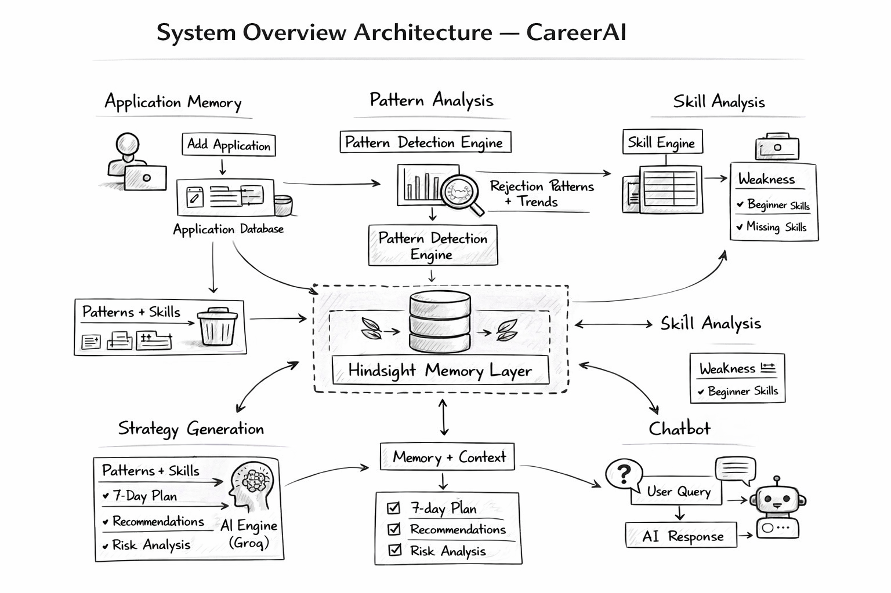

# CAREERAI 🚀
### AI Career Intelligence System Using Hindsight Memory

---

## 🧠 System Overview Architecture

  

---

## 🧠 Problem Statement

Students apply to multiple internships but fail to understand:
- Why they are getting rejected  
- Which skills they lack  
- How to improve their strategy  

Existing tools provide **generic advice** and **do not learn from past attempts**.

---

## 🎯 Solution

CareerAI is an AI-powered system that:
- Tracks application history  
- Learns from past failures  
- Identifies skill gaps  
- Generates personalized strategies  
- Provides context-aware AI chatbot  

---

## 🏗️ Architecture Overview

The system is built around **Hindsight Memory**, enabling:

- Persistent learning  
- Pattern detection  
- Adaptive recommendations  

---

## 🔁 System Flow

Application → Memory → Analysis → Strategy → Improvement

---

## 🧠 Hindsight Memory Usage

- Stores user applications and outcomes  
- Recalls past failures  
- Identifies patterns over time  
- Improves future recommendations  

---

## 🚀 Features

- 📊 Career score + insights  
- 📉 Rejection pattern detection  
- 🧠 Skill gap analysis  
- 📅 7-day action plan  
- 🤖 Context-aware chatbot  

---

## 🛠️ Tech Stack

- Frontend: React  
- Backend: Node.js  
- AI: Groq API  
- Memory: Hindsight  
- Deployment: Vercel + Render  

---

## 🌐 Live Demo

https://career-ai-peach.vercel.app/

---

## 🎥 Demo Video

https://drive.google.com/file/d/1pxLOeK8OpkOgW2MtuDnbv7OZQyFbJzvd/view?usp=sharing

---

## 📌 Key Highlight

👉 AI that **learns from your past**, not just responds.

---

## 🚀 Conclusion

CareerAI demonstrates how AI agents can move from:
❌ Stateless responses  
→ ✅ Memory-driven intelligence